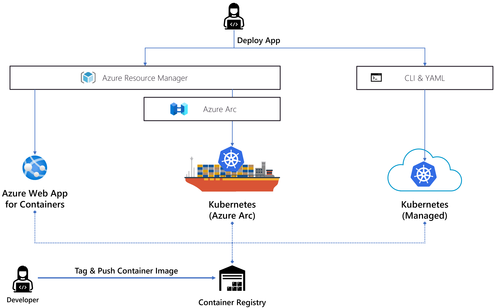
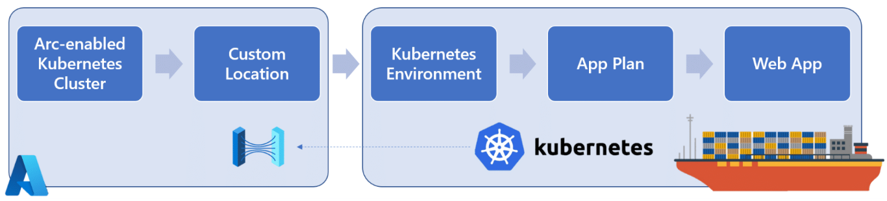

# Cloud Native Demystified: Build Once, Run Anywhere

Resources for our ["Cloud Native Demystified: Build Once, Run Anywhere!" webinar](https://www.codit.eu/en/events/webinars/webinar-cloud-native-demystified-build-once-run-anywhere/).

## Deploying to various runtimes

You can easily deploy the application to various runtimes:

### Azure PaaS ☁

You can easily deploy a container to Azure Web App for Containers through the Azure portal.

### Kubernetes 🔱

Deploy the application on Kubernetes by using `deploy/portal-on-kubernetes.yaml` on any Kubernetes cluster.

### App Service on Azure Arc (Preview) 🚢

Bootstrap your cluster to Azure by using `scripts/Bootstrap-Cluster.ps1` by:

- Connecting your cluster through Azure Arc for Kubernetes
- Installing the App Service extension for Kubernetes
- Creating a custom location to deploy to

After that, you can easily deploy an Azure Web App for Container on your cluster as you typically would, but by using the new custom location.

Here is an overview of the various Arc components:

*Learn more on ["Set up an Azure Arc-enabled Kubernetes cluster to run App Service, Functions, and Logic Apps (Preview)"](https://docs.microsoft.com/en-us/azure/app-service/manage-create-arc-environment?tabs=powershell) and ["Create an App Service app on Azure Arc (Preview)"](https://docs.microsoft.com/en-us/azure/app-service/overview-arc-integration).*
