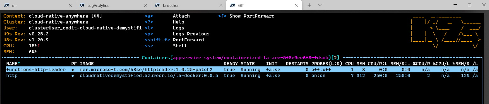
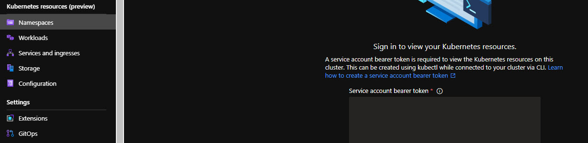
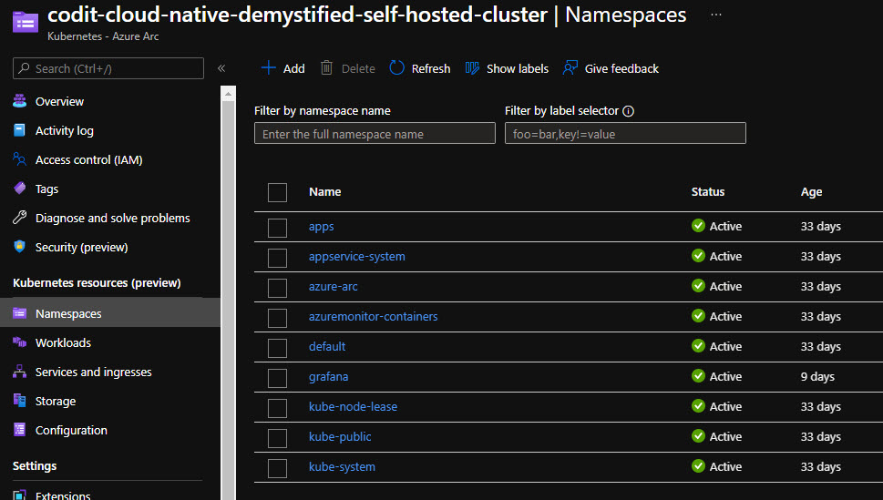

# LogicApps Standard

## Prerequisites

```
vscode: ms-vscode.azure-account
vscode: ms-dotnettools.csharp
vscode: azurite.azurite 
vscode: ms-azuretools.vscode-azurelogicapps
https://github.com/Azure/azure-functions-core-tools/releases/tag/3.0.3785 (func-cli-3.0.3785-x64.msi)
```

## Localhost with vscode

local debug - start azurite

```
npm install -g azurite
azurite start
```

run with vscode (F5)
* right click on the workflow file + overview to get the callback URL
* run the following command

```
$callbackURL="http://localhost:7071/api/WarehouseService/triggers/manual/invoke?api-version=2020-05-01-preview&sp=%2Ftriggers%2Fmanual%2Frun&sv=1.0&sig=Yci3le1fGp0qGSaMMeUGqbqcJqL0x9X0kUJ11ywY9_U"

curl --location --request POST $callbackURL --header 'Content-Type: application/json' --data-raw '{"itemId": 1000}'
```

## Localhost Docker

build the workflow service
```
docker build .\ --tag la-docker:0.0.4 -f .\Dockerfile --no-cache
```

run the container by specifying the Storage Account connection

```
$storageCN = "DefaultEndpointsProtocol=https;AccountName=storageaccountcoditaa53;AccountKey=gCf5fJD+rCwB7HY/NoeX5FtwzsCLyZIFKerG50DAIFSc0O+NoioxdaTUfZiFU80qN5rx8iP+q0h8Lp94bt9ucC==;EndpointSuffix=core.windows.net"

docker run -d -p 5002:80 -e "WEBSITE_HOSTNAME=localhost" -e "WEBSITE_SITE_NAME=WarehouseService" -e "AzureWebJobsStorage=$storageCN" -e "APPINSIGHTS_INSTRUMENTATIONKEY=afded766-1234-1234-1234-afa123474a94" la-docker:0.0.4

docker ps

docker log <conteiner-id>
```

get the callback URL
* get the sdkMasterKey from the 'azure-webjobs-secrets' container

```
$masterKey = "aCv123452oTdNFYlAPs67wYGAXiNmKhetmne7PRW6uewc123456789=="

$sdkWebhook = "http://localhost:5002/runtime/webhooks/workflow/api/management/workflows/WarehouseService/triggers/manual/listCallbackUrl?api-version=2020-05-01-preview&code=$masterKey"

curl --location --request POST $sdkWebhook --header "Content-Length: 0" -v
```

call the workflow
* use the port 5002
* ⚠ use  http instead of https ⚠

```
$wfURL="http://localhost:5002/api/WarehouseService/triggers/manual/invoke?api-version=2020-05-01-preview&sp=%2Ftriggers%2Fmanual%2Frun&sv=1.0&sig=zns6fv3CYkC123456ED8UJjVVMN6EjXpq5wEsx-VXDQ"

curl --location --request POST $wfURL --header 'Content-Type: application/json' --data-raw '{"itemId": 1000}' -v
```

## Push to the registry

```
docker tag la-docker:0.0.4 cloudnativedemystified.azurecr.io/la-docker:0.0.4

docker login -u cloudnativedemystified -p uQ+w123szaabcdkn6MZ8olO4GfSR2gYB cloudnativedemystified.azurecr.io

docker push cloudnativedemystified.azurecr.io/la-docker:0.0.4

```

## LogicApps on ARC

### App Service on Azure Arc (Preview) 🚢

Bootstrap your cluster to Azure by using `scripts/Bootstrap-Cluster.ps1` by:

- Connecting your cluster through Azure Arc for Kubernetes
- Installing the App Service extension for Kubernetes
- Creating a custom location to deploy to

After that, you can easily deploy an Azure Web App for Container on your cluster as you typically would, but by using the new custom location.

Here is an overview of the various Arc components:


*Learn more on ["Set up an Azure Arc-enabled Kubernetes cluster to run App Service, Functions, and Logic Apps (Preview)"](https://docs.microsoft.com/en-us/azure/app-service/manage-create-arc-environment?tabs=powershell) and ["Create an App Service app on Azure Arc (Preview)"](https://docs.microsoft.com/en-us/azure/app-service/overview-arc-integration).*


### LogicApps deployed via ARC

```
az aks get-credentials --resource-group codit-cloud-native-demystified-azure-arc --name cloud-native-anywhere

kubectl get pods -n appservice-system

```

App Services deployed via ARC

```
kubectl get apps.k8se.microsoft.com --all-namespaces
```


LogicApps POD



## Get cluster data in the Azure Arc views

Using the Service account token authentication option.

Get the token 

```
kubectl create serviceaccount admin-user

kubectl create clusterrolebinding admin-user-binding --clusterrole cluster-admin --serviceaccount default:admin-user

SECRET_NAME=$(kubectl get serviceaccount admin-user -o jsonpath='{$.secrets[0].name}')

TOKEN=$(kubectl get secret ${SECRET_NAME} -o jsonpath='{$.data.token}' | base64 -d | sed $'s/$/\\\n/g')
```
Paste the token in the token and sign in to access from Azure to the workload in the remote arc-enabled cluster.



